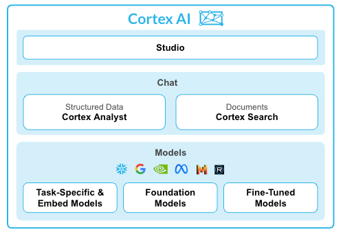

# Snowflake Cortex Analyst & AI Functions Demo Repository

A comprehensive guide and demo application for getting started with **Snowflake Cortex Analyst** and **Cortex AI Functions** - the complete AI toolkit for business analytics and text processing.



## 🚀 Quick Start

This repository contains everything you need to set up and demo both Snowflake Cortex Analyst and Cortex AI functions:

- **Complete setup scripts** for databases, warehouses, and sample data
- **Sample semantic model** with best practices  
- **Interactive Streamlit application** for natural language queries
- **Cortex AI functions demos** with translation, sentiment analysis, summarization
- **Comprehensive documentation** and presentation materials
- **Real sample data** for revenue analytics and text processing use cases

## 📁 Repository Structure

```
├── README.md                          # This file
├── docs/                             # Documentation
│   ├── quickstart-guide.md           # Comprehensive setup guide
│   ├── presentation-agenda.md        # 30-min demo presentation
│   └── best-practices.md             # Implementation best practices
├── sql/                              # SQL Scripts
│   ├── 01_create_objects.sql         # Core Cortex Analyst setup
│   ├── 02_load_data.sql              # Revenue data loading
│   ├── 03_create_search.sql          # Search services setup
│   ├── 04_cortex_functions.sql       # 🆕 AI functions demo
│   └── 05_cortex_ai_setup.sql        # 🆕 AI functions data setup
├── data/                             # Sample data files
│   ├── daily_revenue.csv             # Revenue facts data
│   ├── product.csv                   # Product dimension
│   └── region.csv                    # Region dimension
├── semantic_models/                  # YAML configurations
│   └── revenue_timeseries.yaml       # Semantic model for Cortex Analyst
├── streamlit/                        # Demo application
│   └── cortex_analyst_demo.py        # Interactive Analyst app
├── assets/                           # Images and diagrams
└── LICENSE
```

## 🎯 What's Included?

### Cortex Analyst (Natural Language to SQL)
**Cortex Analyst** is a fully managed conversational AI service in Snowflake that provides:

- **Natural Language to SQL**: Ask questions in plain English, get accurate SQL results
- **Self-Service Analytics**: Empowers business users without SQL knowledge  
- **Industry-Leading Accuracy**: Powered by state-of-the-art LLMs with agentic AI setup
- **Enterprise Security**: Built-in governance and role-based access controls
- **REST API Integration**: Easy integration into existing applications

### Cortex AI Functions (Text Processing & LLMs)
**Cortex AI Functions** provide task-specific AI capabilities:

- **TRANSLATE**: Convert text between 15+ languages automatically
- **SENTIMENT**: Analyze emotional tone and customer satisfaction (-1 to +1 scale)
- **SUMMARIZE**: Create concise summaries of long documents and content
- **COMPLETE**: Custom LLM completions with multiple model options (Claude, Llama, Mistral)
- **COUNT_TOKENS**: Estimate processing costs for budgeting and optimization

## 🛠️ Prerequisites

- **Snowflake Account**: Enterprise Edition or higher
- **Permissions**: CORTEX_USER role (granted to PUBLIC by default)
- **Supported Region**: AWS (us-east-1, us-west-2, eu-west-1, eu-central-1, ap-southeast-2, ap-northeast-1) or Azure (East US 2, West Europe)

## ⚡ Quick Setup Options

### Option 1: Cortex Analyst Only (15 minutes)
For natural language to SQL capabilities:

```bash
git clone https://github.com/your-org/snowflake-cortex-demo.git
cd snowflake-cortex-demo
```

1. Execute: `sql/01_create_objects.sql` - Creates database, schema, warehouse, tables
2. Upload data files from `data/` folder to `@raw_data` stage  
3. Execute: `sql/02_load_data.sql` - Loads sample data
4. Execute: `sql/03_create_search.sql` - Creates search services
5. Upload: `semantic_models/revenue_timeseries.yaml` to `@raw_data` stage
6. Create Streamlit app with: `streamlit/cortex_analyst_demo.py`

### Option 2: Full AI Functions Demo (20 minutes)  
For complete Cortex AI capabilities including text processing:

1. **Follow Option 1 steps above**, then additionally:
2. Execute: `sql/05_cortex_ai_setup.sql` - Sets up call transcripts and multilingual sample data
3. Execute: `sql/04_cortex_functions.sql` - Demonstrates all AI functions with examples

### Option 3: AI Functions Only (10 minutes)
For text processing capabilities only:

1. Execute: `sql/05_cortex_ai_setup.sql` - Sets up sample text data
2. Execute: `sql/04_cortex_functions.sql` - Run AI function examples

## 📊 Demo Use Cases

### 1. Revenue Analytics (Cortex Analyst)
**Natural language queries on business data:**

- **Daily Revenue Facts**: Date, revenue, costs, forecasted revenue by product/region
- **Product Dimension**: Product lines (Electronics, Clothing, Home Appliances, etc.)
- **Region Dimension**: Sales regions and states

**Sample Questions:**
```
• "What was our total revenue last month?"
• "Which product line has the highest profit margin?"  
• "Show me revenue trends by region"
• "Compare actual vs forecasted revenue"
• "What is our average daily revenue by product line?"
```

### 2. Text Processing & Multilingual Content (Cortex AI Functions)
**AI-powered text analysis and processing:**

- **Customer Service Transcripts**: Real call center data for sentiment analysis
- **Multilingual Feedback**: Customer reviews in German, French, Spanish, English
- **Business Documents**: Meeting notes, reports, and technical documentation

**Sample Use Cases:**
```
• Translate customer feedback from any language to English
• Analyze sentiment of customer reviews and support tickets
• Summarize long business documents and meeting notes  
• Extract structured data from unstructured text
• Generate content and automate responses
• Count tokens for cost estimation and optimization
```

## 💰 Cost Considerations

**Cortex Analyst Pricing (2025):**
- **Token-based pricing**: ~$0.002 per 1K input tokens, ~$0.008 per 1K output tokens
- **Warehouse costs**: Standard Snowflake compute rates
- **Sample cost**: 100 daily queries ≈ $0.01-$0.10

**Cortex AI Functions Pricing:**
- **Translation**: ~$0.001 per 1K tokens
- **Sentiment/Summarize**: ~$0.002 per 1K tokens  
- **Complete**: Varies by model (~$0.002-$0.020 per 1K tokens)

**Cost Optimization Tips:**
- Use SMALL warehouses (larger ones don't improve LLM performance)
- Start with focused use cases and scale gradually
- Use `COUNT_TOKENS` function for cost estimation
- Set up resource monitors for budget control

## 🎓 Learning Path

### Beginner (Start here)
1. **Follow Option 2 setup** for complete experience
2. **Try Cortex Analyst demo** with revenue questions
3. **Experiment with AI functions** using provided examples
4. **Review semantic model** structure and best practices

### Intermediate  
1. **Customize semantic model** for your own data
2. **Create multilingual workflows** combining translation + sentiment
3. **Build custom applications** using both Analyst and AI functions
4. **Implement cost monitoring** and governance

### Advanced
1. **REST API integration** into existing applications
2. **Multi-model semantic files** for complex analytics
3. **Advanced prompt engineering** for custom completions
4. **Production deployment** with security and monitoring

## 📋 Presentation Materials

Ready to demo to your team? We've included:

- **30-minute presentation agenda** (`docs/presentation-agenda.md`)
- **Speaker notes and talking points** for both Analyst and AI functions
- **Visual diagrams** explaining architectures and workflows
- **Sample questions** showcasing all capabilities
- **Cost and ROI discussion** materials
- **Live demo scripts** with backup examples

Perfect for capability showcases, lunch & learns, or executive demos.

## 🔧 What's New - AI Functions Demo

### Comprehensive Examples Include:
- **Translation Workflows**: Single text, batch processing, business use cases
- **Sentiment Analysis**: Customer reviews, support tickets, multilingual feedback
- **Document Summarization**: Business reports, meeting notes, customer calls
- **Custom Completions**: Structured data extraction, content generation, code creation
- **Token Counting**: Cost estimation, performance optimization
- **Model Comparison**: Side-by-side testing of different LLMs
- **Combined Workflows**: Multi-step processing (translate → sentiment → summarize)

### Real Sample Data:
- **Call Transcripts**: Actual customer service conversations
- **Multilingual Content**: Reviews and feedback in 4+ languages
- **Business Documents**: Realistic meeting notes and reports
- **Customer Feedback**: Authentic product reviews with varying sentiment

## 🤝 Contributing

We welcome contributions! Please see our contributing guidelines:

1. Fork the repository
2. Create a feature branch
3. Add tests for new functionality  
4. Submit a pull request

## 📚 Additional Resources

### Cortex Analyst Resources:
- [Snowflake Cortex Documentation](https://docs.snowflake.com/en/user-guide/snowflake-cortex)
- [Cortex Analyst API Reference](https://docs.snowflake.com/en/user-guide/snowflake-cortex/cortex-analyst)
- [Semantic Model Specification](https://docs.snowflake.com/en/user-guide/snowflake-cortex/cortex-analyst/semantic-model-spec)

### Cortex AI Functions Resources:
- [Cortex AI Functions Guide](https://quickstarts.snowflake.com/guide/getting-started-with-snowflake-cortex-ai/)
- [LLM Function Reference](https://docs.snowflake.com/en/user-guide/snowflake-cortex/llm-functions)
- [Supported Languages List](https://docs.snowflake.com/en/user-guide/snowflake-cortex/llm-functions#translation)

## 📜 License

This project is licensed under the MIT License - see the [LICENSE](LICENSE) file for details.

## 🏷️ Tags

`snowflake` `cortex-analyst` `cortex-ai` `llm` `natural-language` `sql` `analytics` `translation` `sentiment-analysis` `summarization` `self-service` `business-intelligence` `conversational-ai`

---

**Built with ❄️ by the Snowflake Community**

*Ready to unlock the full power of AI-powered analytics and text processing? Let's get started!* 🚀